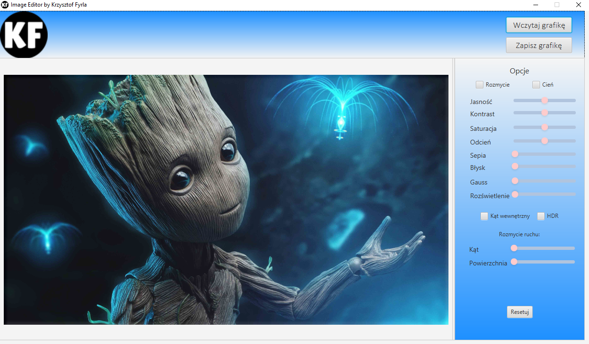

# IMAGE EDITOR

Image editor created with the help of JavaFX and using the possibility of using the graphic library.

## Technologies
Project is created with:
* JAVA version 8
* Java FX

## Features
* Reading and writing image files
* Editing images 

## Information
You will find more information:
https://krzysztoffyrla.pl
